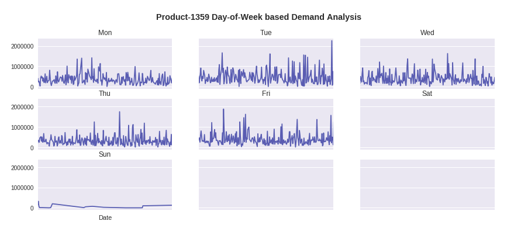

# EECS 731: The Oscars (Assignment # 07)

### Quick Note:
If you are interested in only looking at notebook, please access the notebook in **/notebooks/visualizations.ipynb**.

/notebooks: Contains the notebook of this assignment.

/data: Contains the data csv file (historical_product_demand.csv)

Also, some content of this assignment and my assignment # 05 (World Wide Products Inc.) notebook will be similar, as I have used the same datasets for both assignments.

### Objective:

Great stories and great visual effects

1. Set up a data science project structure in a new git repository in your GitHub account

2. Download any of the data sets from previous projects

3. Load the data set into panda data frames

4. Formulate one or two ideas on how storytelling and visualization would help describe the data set and establish additional value

5. Build three or more compelling visualizations

6. Document your process and results

7. Commit your notebook, source code, visualizations and other supporting files to the git repository in GitHub

### Datasets:

I used the given Forecasts for Product Demand dataset (https://www.kaggle.com/felixzhao/productdemandforecasting) for this Demand Forecasting modeling assignment. (Data csv file is in /data/historical_product_demand.csv).

### Process:

<ul>
<li>First, I loaded the given csv file into the Pandas Dataframe. (Please see the /notebooks/visualizations.ipynb for more details)</li>
<li>Then, I did feature engineering and cleaning process.</li>
 <li> Finally, we drew and analyzed four time-based compelling visualizations to get some insights about the given dataset products, and inferred some key facts from these graphs. Please refer to notebook for more details.These four analysis are also given below and are Weekly based, Monthly based and Years Weeks based trends.</li>
 </ul>

*The process and results are detailed as follows, as well as in /notebooks/visualizations.ipynb notebook.*

### Discussion and Results:

First, we do feature engineering and cleaning process.

The given dataset, once loaded into the dataframe, was as follows:

Although we have **2,160** unique products, but to simplify the process, we limit the scope of our visualization process by focusing on one **most in-demand top** product. As from our analysis given in the notebook, we observed that the **product Product_1359 is the top product**, so we focus on it during this project and draw four compelling visualizations and infer some valuable insights about this product. 

**Movies Dataset Analysis:**

As shown above, the movies csv file contains total **9724** unique movies. Consequenly, from the table, it is evident that it provides movies names and their **genre**. We can use the **genre** and **title** features for data modeling or visualizaing great insights.

**Ratings Dataset Analysis**

As seen above, **610** users participated in movie ratings for **9724** unique movies. This dataset also has timestamp that may be useful in time based analysis or modeling. But for this assignment, for merging process later, I dropped this feature being not useful (as part of **feautre engineering/cleaning process**).

**Tags Dataset Analysis**

The tag dataset csv file contains tags that are given by the users to different movies. As shown above, **1572 (out of total 9724)** movies have been given total **1460** tags or keywords by **58 (out of total 610)** unique and different users. The tag feature assigned to different movies can be used for **drawing compelling visualizations**.

### Datasets Cleaning and Merging Process

Next, we are merging different datapoints into single dataset that can be used for further process (e.g. Data Modeling for classification, clustering or regression purpose).

First, we **merge** *movies* and *ratings* data frames based on common *movieId* feature, followed by merging the resultant table with tags table based on *movieId* and *userId* featues.

As we can see that there are some NaN values in the resultant table. So, we **drop** rows with any NaN value.

This final dataframe also has some interesting insights, as follows:

**Unique Users :  54**

**Unique Movies :  1464**

**Unique Tags :  1424**

Consequently, number of row are reduced from *1,02,695* to just *3,476* rows, but more cleaner and ready to be used by data visualization process.

# Compelling Visualizations using Individual Dataframes and Merged/Combined Dataframe

1) First compelling visualization that will be helpful is to get **TOP 20 MOVIE TAGS**, as shown in the graph below. It will give us information about the dominant style of movies in the given movie datasets.

# Conclusion

**Story telling and the Data visualization** are the main and vital components that can be considered as the main objective of any data science based explorative analysis. In this project, I learnt about few ways to yield compelling visualizations that can be helpful in telling interesting and valuable story about the data. First e cleaned the datasets, followed by merging them into a single common dataframe. Then, using individual dataframes (Movies, Ratings, Tags) as well as combined/merged dataframe, we **obtained several compelling visuaizations to tell valuable story about the given datasets**.

# References

1) https://github.com/usajid/731_assign3
