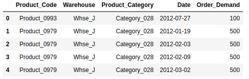

# EECS 731: The Oscars (Assignment # 07)

### Quick Note:
If you are interested in only looking at notebook, please access the notebook in **/notebooks/visualizations.ipynb**.

/notebooks: Contains the notebook of this assignment.

/data: Contains the data csv file (historical_product_demand.csv)

Also, some content of this assignment and my assignment # 05 (World Wide Products Inc.) notebook will be similar, as I have used the same datasets for both assignments.

### Objective:

Great stories and great visual effects

1. Set up a data science project structure in a new git repository in your GitHub account

2. Download any of the data sets from previous projects

3. Load the data set into panda data frames

4. Formulate one or two ideas on how storytelling and visualization would help describe the data set and establish additional value

5. Build three or more compelling visualizations

6. Document your process and results

7. Commit your notebook, source code, visualizations and other supporting files to the git repository in GitHub

### Datasets:

I used the given Forecasts for Product Demand dataset (https://www.kaggle.com/felixzhao/productdemandforecasting) for this Demand Forecasting modeling assignment. (Data csv file is in /data/historical_product_demand.csv).

### Process:

<ul>
<li>First, I loaded the given csv file into the Pandas Dataframe. (Please see the /notebooks/visualizations.ipynb for more details)</li>
<li>Then, I did feature engineering and cleaning process.</li>
 <li> Finally, we drew and analyzed four time-based compelling visualizations to get some insights about the given dataset products, and inferred some key facts from these graphs. Please refer to notebook for more details.These four analysis are also given below and are Weekly based, Monthly based and Years Weeks based trends.</li>
 </ul>

*The process and results are detailed as follows, as well as in /notebooks/visualizations.ipynb notebook.*

### Discussion and Results:

First, we do feature engineering and cleaning process.

The given dataset, once loaded into the dataframe, was as follows:

Although we have **2,160** unique products, but to simplify the process, we limit the scope of our visualization process by focusing on one **most in-demand top** product. As from our analysis given in the notebook, we observed that the **product Product_1359 is the top product**, so we focus on it during this project and draw **four compelling visualizations** and infer some valuable and key insights from them about this product. 

# Compelling Visualizations and Story-telling

### 1) Product Demand Over Time
First compelling visualization that will be helpful is to get **product demand trend over the time**. It will give us information about the product demand over different time periods.

**Inference from Visualization:** Now, we again plot and this time it looks more real world and practical for all date index values, as shown in the above graph. From the above graph, we can see that the **Product # 1359 's demand over time follows almost the same consistent pattern over each year with some spikes occuring at the end months of each year. This looks reasonable as end of year is the shoppping season, thus, justifying these spikes**.

### 2) Time Based Analysis on Demand Trend # 01 : Day-of-Week

**Inference from Visualization:** As clear from the above graphs, there is almost no demand for Product # 1359 on weekend days (Saturdays and Sundays). For remaining days, most high demand peaks are in the **middle section of the days** as expected normally.

### 3) Time Based Analysis on Demand Trend # 02 :  Month-of-Year
---

**Inference from Visualization:** The above monthly demand trend graphs indicate that the demand for the Product # 1359 is almost zero at the end of most of the months (February, March, April, May, June, July, August, September, October, November). So, this non-uniformity can be tricky to handle, if we do not use the month based trends. Thus, monthy trends seem to be providing with very valuable insights about the data. For December and January, the demand is quite good throughout the whole month, which I suppose is, due to the **shopping season**.

### 4) Time Based Analysis on Demand Trend # 03 :  Week-of-Year
---
In the last demand trend analysis, we see the demand trend for each specific week of the year by accumulating all the orders for that week in all years.

**Inference from Visualization:** This accumulation based analysis indicates that weekly trend is quite smooth and can be useful for any time based analysis.

# Conclusion

**Story telling and the Data visualization** are the main and vital components that can be considered as the main objective of any data science based explorative analysis. In this project, I learnt about few ways to yield compelling visualizations that can be helpful in telling interesting and valuable story about the data. To get insights into the time-series data, we learnt that some time units (**weekly, monthly, yearly**) are really helpful. Consequently, we analyzed the given dataset using these newly created time based units that gave us valauble insights about the given dataset products. Consequently, we **obtained four compelling visuaizations to tell valuable story about the given datasets products**. I also learnt that **story-telling is art and visualizations can help in demonstrating that art**.

# References

1) https://github.com/Usajid/731_assign5
